# ZwróćTo

Aplikacja mobilna wspomagająca zwrot opakowań wielokrotnego użytku. Użytkownicy mogą lokalizować automaty zwrotne na mapie, śledzić swoje zwroty, zbierać nagrody i zarządzać portfelem punktów i zebranych środków.

---

## Screeny aplikacji

### Ekran mapy / automatów

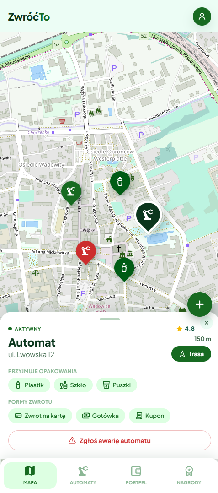

### Logowanie

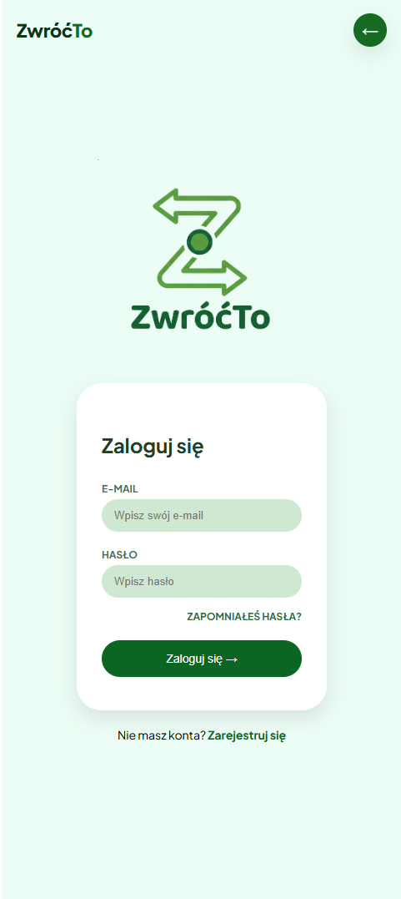

### Rejestracja

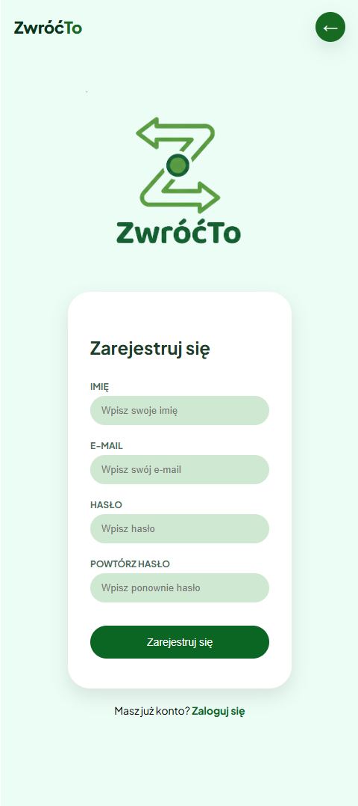

### Przywracanie hasła

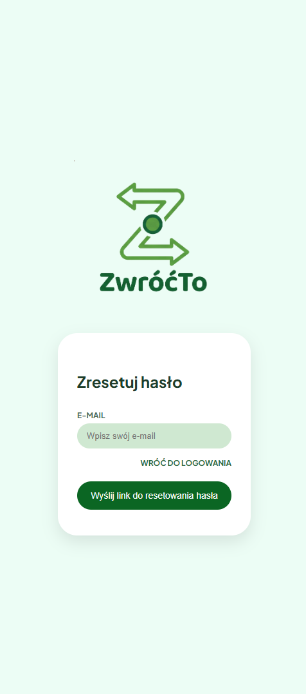

### Profil użytkownika

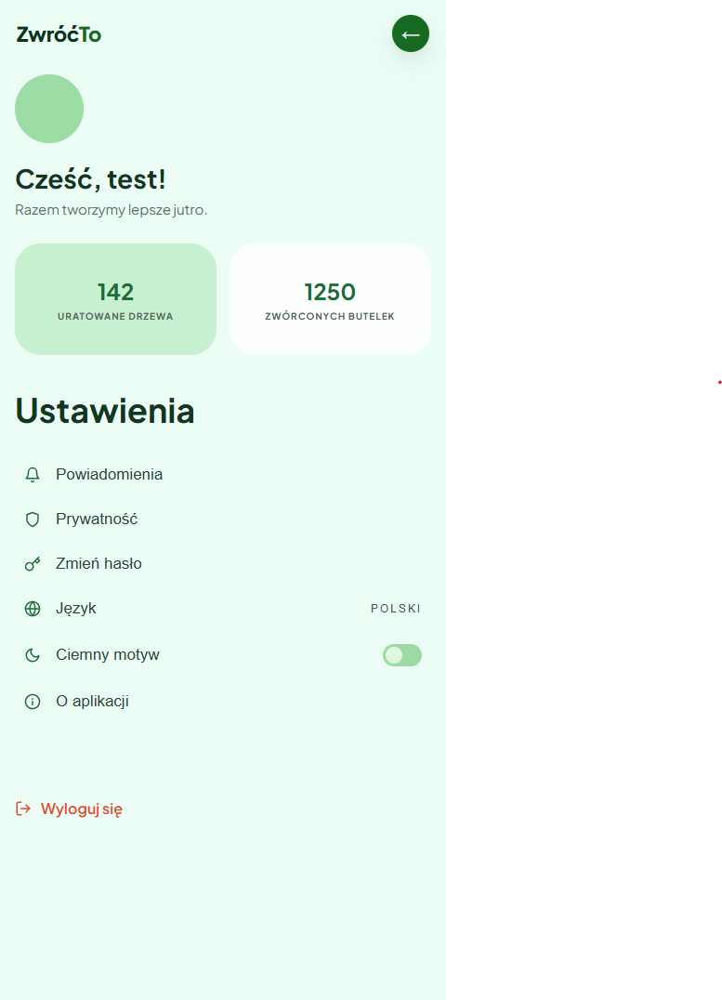

### Portfel

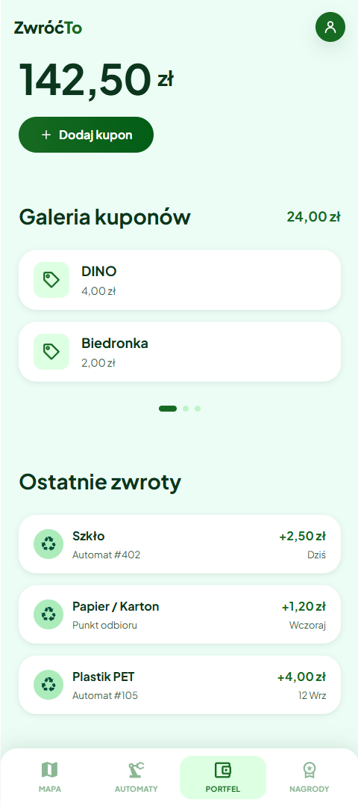

### Nagrody

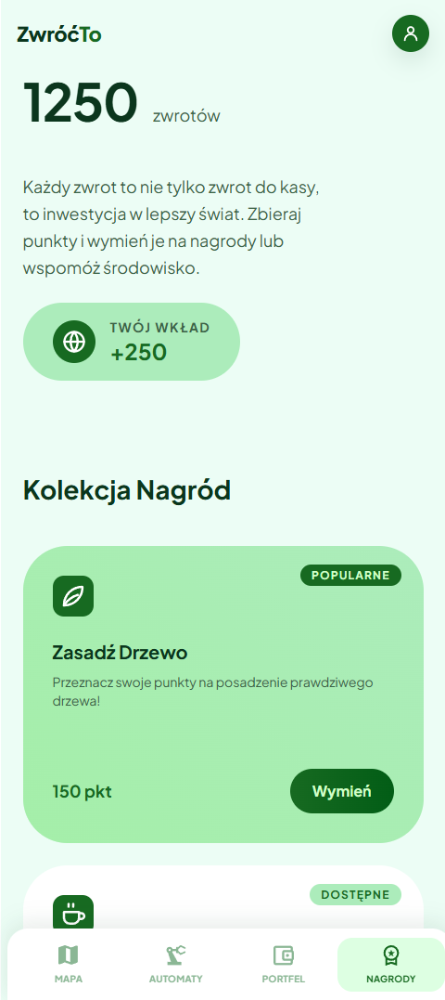

### Skanowanie kuponu


---

## Struktura projektu

Projekt zbudowany jest w React (Create React App) z podziałem na:

- **`src/pages/`** — osobne komponenty stron, po jednym na każdy ekran z prototypu
- **`src/components/`** — wielokrotnie używane elementy UI (nagłówek, nawigacja, przyciski FAB, arkusze dolne, oceny gwiazdkowe, itp.)
- **`src/firebase.js`** — konfiguracja Firebase (Authentication + Analytics)

### Ekrany i odpowiadające im ścieżki React Router

| Ścieżka             | Komponent         | Opis                            |
| ------------------- | ----------------- | ------------------------------- |
| `/`                 | redirect → `/map` | Przekierowanie na mapę          |
| `/map`              | `MapScreen`       | Mapa z automatami zwrotnymi     |
| `/automaty`         | `MapScreen`       | Alias widoku mapy               |
| `/login`            | `Login`           | Logowanie użytkownika           |
| `/register`         | `Register`        | Rejestracja nowego konta        |
| `/restore_password` | `RestorePassword` | Resetowanie hasła               |
| `/profile`          | `Profile`         | Profil zalogowanego użytkownika |
| `/portfel`          | `Portfel`         | Portfel punktów                 |
| `/nagrody`          | `Nagrody`         | Dostępne nagrody                |
| `/skanuj-kupon`     | `ScanCoupon`      | Skanowanie kuponu               |

---

## Technologie

- **React** - biblioteka UI
- **React Router** — routing po stronie klienta
- **Firebase Authentication** — logowanie użytkowników
- **Firebase Analytics / Google Analytics** — śledzenie zdarzeń i odsłon stron
- **Contentsquare** — analiza zachowań użytkowników (mapy ciepła, nagrania sesji)
- **Firebase Hosting** — hosting produkcyjny

Pierwotnie planowano integrację z Hotjar, jednak narzędzie to zostało przejęte przez Contentsquare. W projekcie użyto bezpośrednio platformy **Contentsquare**, która oferuje analogiczną funkcjonalność (nagrania sesji, mapy ciepła).

---

## Logowanie użytkowników — Firebase Authentication

Uwierzytelnianie zrealizowane jest przy użyciu **Firebase Authentication** (metoda e-mail + hasło). Konfiguracja inicjalizowana jest w `src/firebase.js` z danymi pobieranymi ze zmiennych środowiskowych (plik `.env.local` oraz github secrets).

Wymagane zmienne środowiskowe:

```env
REACT_APP_FIREBASE_API_KEY=...
REACT_APP_FIREBASE_AUTH_DOMAIN=...
REACT_APP_FIREBASE_PROJECT_ID=...
REACT_APP_FIREBASE_STORAGE_BUCKET=...
REACT_APP_FIREBASE_MESSAGING_SENDER_ID=...
REACT_APP_FIREBASE_APP_ID=...
REACT_APP_FIREBASE_MEASUREMENT_ID=...
```

---

## Google Analytics

Śledzenie zdarzeń zrealizowane przez Firebase Analytics. Każda zmiana ścieżki w React Router automatycznie wysyła zdarzenie `page_view` z parametrem `page_path`.

### Screeny z Google Analytics

#### Przegląd ruchu

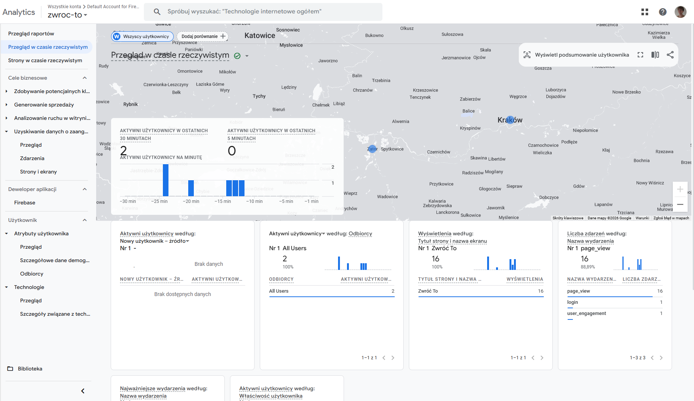

#### Zdarzenia

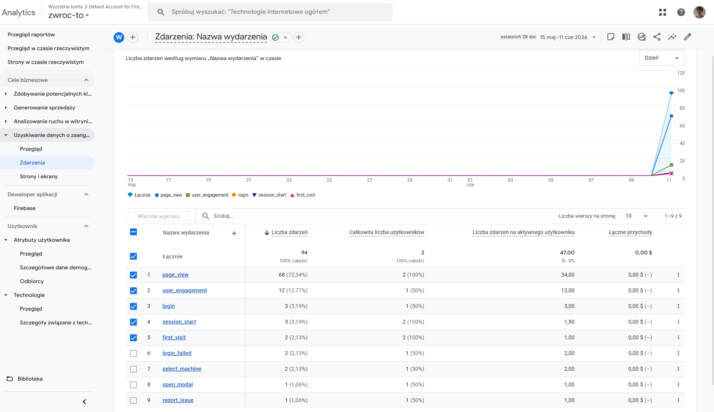

#### Aktywni użytkownicy

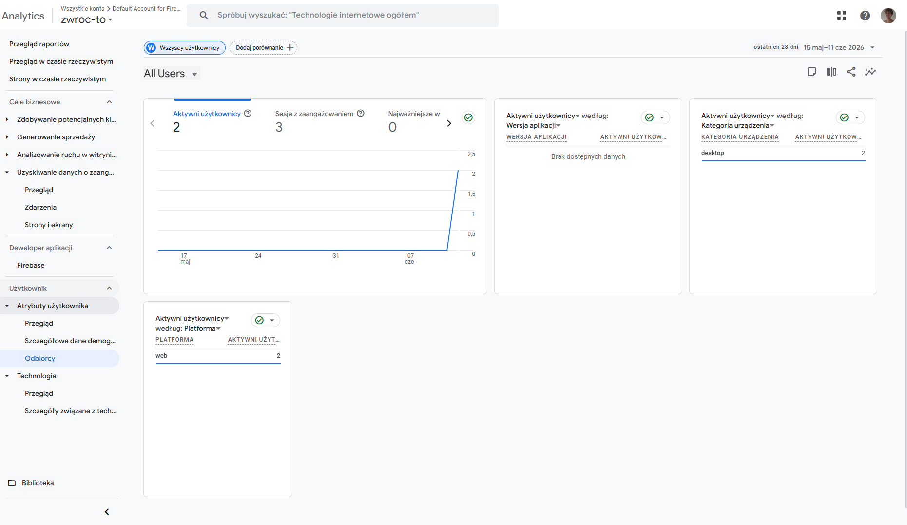

---

## Contentsquare (analiza zachowań użytkowników)

Do analizy zachowań użytkowników zintegrowano **Contentsquare**. Narzędzie umożliwia nagrywanie sesji użytkowników oraz generowanie map ciepła dla poszczególnych ekranów.

### Screeny z Contentsquare

#### Nagrania sesji

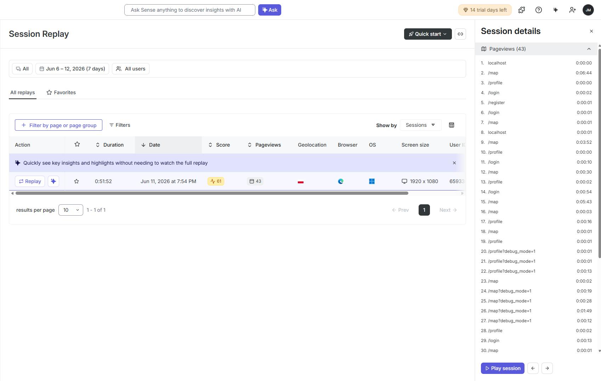

#### Mapa ciepła — ekran mapy

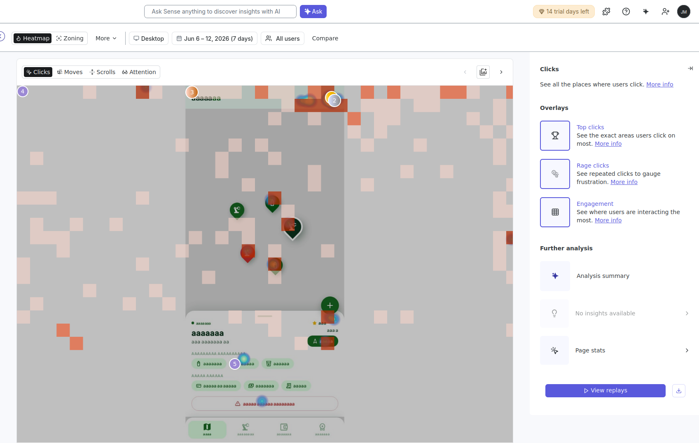

#### Analiza lejka / podróż użytkownika

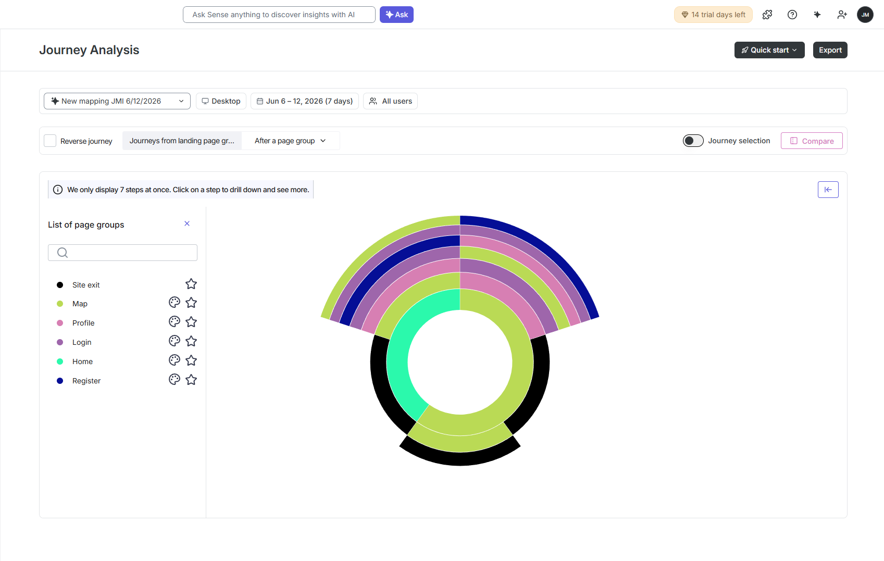

---

## Deploy

Aplikacja została wdrożona dzięki **Firebase Hosting**. Dodatkowo zostały użyte github workflows do automatycznego deploy'owania przy każdej zmianie na branchy `main`

```bash
npm run build
firebase deploy --only hosting
```

---

## Uruchomienie lokalne

```bash
npm install
npm start
```

Aplikacja dostępna pod adresem [http://localhost:3000](http://localhost:3000).

### Budowanie produkcyjne

```bash
npm run build
```

Pliki wynikowe trafiają do katalogu `build/`.
